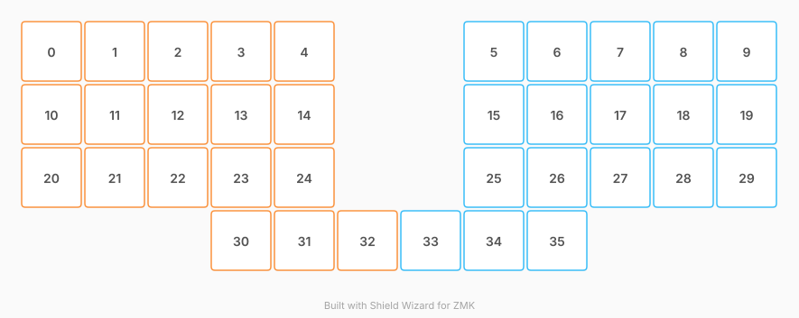

# ZMK Configuration for Ergo Tastatur

*Generated by Shield Wizard for ZMK*



Download compiled firmware from the Actions tab. <https://zmk.dev/docs/user-setup#installing-the-firmware>

Edit your keymap <https://zmk.dev/docs/keymaps>.
User keymap is located at [`config/ergo_tastatur.keymap`](config/ergo_tastatur.keymap).

-----

<details>
<summary>
Shield Wizard Debug Information
</summary>

In case of broken configuration, here is the Shield Wizard internal data used to generate this configuration:

Commit: ab99418c376887d043556e4a1af5a8d1c78d686c

```json
{"name":"Ergo Tastatur","shield":"ergo_tastatur","dongle":false,"modules":[],"layout":[{"id":"01M2340XK9N4MRE57SG4SKGZY0","part":0,"row":0,"col":0,"w":1,"h":1,"x":0,"y":0,"r":0,"rx":0,"ry":0},{"id":"01M2340XVGH56NRY9W0KAMHP8G","part":0,"row":0,"col":1,"w":1,"h":1,"x":1,"y":0,"r":0,"rx":0,"ry":0},{"id":"01M2340Y089W9EP0ABMCYVPDAC","part":0,"row":0,"col":2,"w":1,"h":1,"x":2,"y":0,"r":0,"rx":0,"ry":0},{"id":"01M2340Y5G4B96NQFTXF5VANJB","part":0,"row":0,"col":3,"w":1,"h":1,"x":3,"y":0,"r":0,"rx":0,"ry":0},{"id":"01M2340YARAXSCV40E1FSSGBA3","part":0,"row":0,"col":4,"w":1,"h":1,"x":4,"y":0,"r":0,"rx":0,"ry":0},{"id":"01M2341ZE9ZVYGTX839GEYVPJT","part":1,"row":0,"col":7,"w":1,"h":1,"x":7,"y":0,"r":0,"rx":0,"ry":0},{"id":"01M2341ZE9G3W7ECV92YKMBSSK","part":1,"row":0,"col":8,"w":1,"h":1,"x":8,"y":0,"r":0,"rx":0,"ry":0},{"id":"01M2341ZE7AVQ6T0NF84VMVET7","part":1,"row":0,"col":9,"w":1,"h":1,"x":9,"y":0,"r":0,"rx":0,"ry":0},{"id":"01M2341ZE7T96PQ0MN2SNSQ4JC","part":1,"row":0,"col":10,"w":1,"h":1,"x":10,"y":0,"r":0,"rx":0,"ry":0},{"id":"01M2341ZE65NP0W8KF6VC3N6AF","part":1,"row":0,"col":11,"w":1,"h":1,"x":11,"y":0,"r":0,"rx":0,"ry":0},{"id":"01M2340YG84HBREBV0VBTQPXYZ","part":0,"row":1,"col":0,"w":1,"h":1,"x":0,"y":1,"r":0,"rx":0,"ry":0},{"id":"01M2340YN06V8PPZ46TK6B4B7A","part":0,"row":1,"col":1,"w":1,"h":1,"x":1,"y":1,"r":0,"rx":0,"ry":0},{"id":"01M2340YT8CM3A5X74V83NHVFZ","part":0,"row":1,"col":2,"w":1,"h":1,"x":2,"y":1,"r":0,"rx":0,"ry":0},{"id":"01M2340YZ82PQB7JPXQJY725QJ","part":0,"row":1,"col":3,"w":1,"h":1,"x":3,"y":1,"r":0,"rx":0,"ry":0},{"id":"01M2340Z40FEV35QS8M5X90R9N","part":0,"row":1,"col":4,"w":1,"h":1,"x":4,"y":1,"r":0,"rx":0,"ry":0},{"id":"01M2341ZE6J0B3PBJFQCDM6FVY","part":1,"row":1,"col":7,"w":1,"h":1,"x":7,"y":1,"r":0,"rx":0,"ry":0},{"id":"01M2341ZE52HWPMNP33E5FXJVF","part":1,"row":1,"col":8,"w":1,"h":1,"x":8,"y":1,"r":0,"rx":0,"ry":0},{"id":"01M2341ZE5Z5QWE3B6Y6C54REC","part":1,"row":1,"col":9,"w":1,"h":1,"x":9,"y":1,"r":0,"rx":0,"ry":0},{"id":"01M2341ZE4HPG5HNNCT4C28A64","part":1,"row":1,"col":10,"w":1,"h":1,"x":10,"y":1,"r":0,"rx":0,"ry":0},{"id":"01M2341ZE4TYAE5PRXVMFGNQKT","part":1,"row":1,"col":11,"w":1,"h":1,"x":11,"y":1,"r":0,"rx":0,"ry":0},{"id":"01M2340Z8RV3P9E0FDC3CE29DB","part":0,"row":2,"col":0,"w":1,"h":1,"x":0,"y":2,"r":0,"rx":0,"ry":0},{"id":"01M2340ZE8595BPTSC7GVJ2PS8","part":0,"row":2,"col":1,"w":1,"h":1,"x":1,"y":2,"r":0,"rx":0,"ry":0},{"id":"01M2340ZM0XTDZV4SRDH5A719F","part":0,"row":2,"col":2,"w":1,"h":1,"x":2,"y":2,"r":0,"rx":0,"ry":0},{"id":"01M2340ZSGR8M10X758D28YWVN","part":0,"row":2,"col":3,"w":1,"h":1,"x":3,"y":2,"r":0,"rx":0,"ry":0},{"id":"01M2340ZYR84DS09BPJX3YYZJB","part":0,"row":2,"col":4,"w":1,"h":1,"x":4,"y":2,"r":0,"rx":0,"ry":0},{"id":"01M2341ZE46752WRP1TVKPMW1T","part":1,"row":2,"col":7,"w":1,"h":1,"x":7,"y":2,"r":0,"rx":0,"ry":0},{"id":"01M2341ZE3JZV0ATNB0YTDCMT5","part":1,"row":2,"col":8,"w":1,"h":1,"x":8,"y":2,"r":0,"rx":0,"ry":0},{"id":"01M2341ZE3NK8B1B4GNQWSDV8E","part":1,"row":2,"col":9,"w":1,"h":1,"x":9,"y":2,"r":0,"rx":0,"ry":0},{"id":"01M2341ZE2270ZES3D3Z6DAMZ5","part":1,"row":2,"col":10,"w":1,"h":1,"x":10,"y":2,"r":0,"rx":0,"ry":0},{"id":"01M2341ZE253F0S4AS42KE7VNB","part":1,"row":2,"col":11,"w":1,"h":1,"x":11,"y":2,"r":0,"rx":0,"ry":0},{"id":"01M234104GJC7ZA87FMVDXAY0P","part":0,"row":3,"col":3,"w":1,"h":1,"x":3,"y":3,"r":0,"rx":0,"ry":0},{"id":"01M234108GH11G35BF433PBQVJ","part":0,"row":3,"col":4,"w":1,"h":1,"x":4,"y":3,"r":0,"rx":0,"ry":0},{"id":"01M23410CGR75YVC1RQZHDN8HR","part":0,"row":3,"col":5,"w":1,"h":1,"x":5,"y":3,"r":0,"rx":0,"ry":0},{"id":"01M2341ZE22V9XDK7KYGK13ETY","part":1,"row":3,"col":6,"w":1,"h":1,"x":6,"y":3,"r":0,"rx":0,"ry":0},{"id":"01M2341ZE10S9Y426VV13FJX6P","part":1,"row":3,"col":7,"w":1,"h":1,"x":7,"y":3,"r":0,"rx":0,"ry":0},{"id":"01M2341ZE1G1NJ9NFWS09MKBMM","part":1,"row":3,"col":8,"w":1,"h":1,"x":8,"y":3,"r":0,"rx":0,"ry":0}],"parts":[{"name":"left","controller":"nice_nano_v2","pins":{"d1":{"usage":"kscan","kscan":"01M2345EGGYHNMM49G5Y5NX0R6","role":"input"},"d0":{"usage":"kscan","kscan":"01M2345EGGYHNMM49G5Y5NX0R6","role":"input"},"d2":{"usage":"kscan","kscan":"01M2345EGGYHNMM49G5Y5NX0R6","role":"input"},"d21":{"usage":"kscan","kscan":"01M2345EGGYHNMM49G5Y5NX0R6","role":"input"},"d4":{"usage":"kscan","kscan":"01M2345EGGYHNMM49G5Y5NX0R6","role":"input"},"d5":{"usage":"kscan","kscan":"01M2345EGGYHNMM49G5Y5NX0R6","role":"input"},"d6":{"usage":"kscan","kscan":"01M2345EGGYHNMM49G5Y5NX0R6","role":"input"},"d7":{"usage":"kscan","kscan":"01M2345EGGYHNMM49G5Y5NX0R6","role":"input"},"d8":{"usage":"kscan","kscan":"01M2345EGGYHNMM49G5Y5NX0R6","role":"input"},"d9":{"usage":"kscan","kscan":"01M2345EGGYHNMM49G5Y5NX0R6","role":"input"},"d10":{"usage":"kscan","kscan":"01M2345EGGYHNMM49G5Y5NX0R6","role":"input"},"d16":{"usage":"kscan","kscan":"01M2345EGGYHNMM49G5Y5NX0R6","role":"input"},"d14":{"usage":"kscan","kscan":"01M2345EGGYHNMM49G5Y5NX0R6","role":"input"},"d15":{"usage":"kscan","kscan":"01M2345EGGYHNMM49G5Y5NX0R6","role":"input"},"d18":{"usage":"kscan","kscan":"01M2345EGGYHNMM49G5Y5NX0R6","role":"input"},"d19":{"usage":"kscan","kscan":"01M2345EGGYHNMM49G5Y5NX0R6","role":"input"},"d20":{"usage":"kscan","kscan":"01M2345EGGYHNMM49G5Y5NX0R6","role":"input"},"d3":{"usage":"kscan","kscan":"01M2345EGGYHNMM49G5Y5NX0R6","role":"input"}},"kscans":[{"kind":"direct","id":"01M2345EGGYHNMM49G5Y5NX0R6","mode":"gnd"}],"keys":{"01M2340YARAXSCV40E1FSSGBA3":{"input":"d1"},"01M2340Z40FEV35QS8M5X90R9N":{"input":"d0"},"01M2340ZYR84DS09BPJX3YYZJB":{"input":"d2"},"01M2340Y5G4B96NQFTXF5VANJB":{"input":"d21"},"01M2340Y089W9EP0ABMCYVPDAC":{"input":"d4"},"01M2340ZM0XTDZV4SRDH5A719F":{"input":"d5"},"01M2340YN06V8PPZ46TK6B4B7A":{"input":"d6"},"01M234108GH11G35BF433PBQVJ":{"input":"d7"},"01M234104GJC7ZA87FMVDXAY0P":{"input":"d8"},"01M2340YG84HBREBV0VBTQPXYZ":{"input":"d9"},"01M23410CGR75YVC1RQZHDN8HR":{"input":"d14"},"01M2340Z8RV3P9E0FDC3CE29DB":{"input":"d10"},"01M2340XK9N4MRE57SG4SKGZY0":{"input":"d16"},"01M2340ZE8595BPTSC7GVJ2PS8":{"input":"d15"},"01M2340XVGH56NRY9W0KAMHP8G":{"input":"d18"},"01M2340YT8CM3A5X74V83NHVFZ":{"input":"d19"},"01M2340ZSGR8M10X758D28YWVN":{"input":"d20"},"01M2340YZ82PQB7JPXQJY725QJ":{"input":"d3"}},"encoders":[],"buses":{}},{"name":"right","controller":"nice_nano_v2","pins":{"d1":{"usage":"kscan","kscan":"01M2348BD08DFTZ9WSNM0CZBCT","role":"input"},"d0":{"usage":"kscan","kscan":"01M2348BD08DFTZ9WSNM0CZBCT","role":"input"},"d2":{"usage":"kscan","kscan":"01M2348BD08DFTZ9WSNM0CZBCT","role":"input"},"d3":{"usage":"kscan","kscan":"01M2348BD08DFTZ9WSNM0CZBCT","role":"input"},"d4":{"usage":"kscan","kscan":"01M2348BD08DFTZ9WSNM0CZBCT","role":"input"},"d5":{"usage":"kscan","kscan":"01M2348BD08DFTZ9WSNM0CZBCT","role":"input"},"d6":{"usage":"kscan","kscan":"01M2348BD08DFTZ9WSNM0CZBCT","role":"input"},"d7":{"usage":"kscan","kscan":"01M2348BD08DFTZ9WSNM0CZBCT","role":"input"},"d8":{"usage":"kscan","kscan":"01M2348BD08DFTZ9WSNM0CZBCT","role":"input"},"d9":{"usage":"kscan","kscan":"01M2348BD08DFTZ9WSNM0CZBCT","role":"input"},"d10":{"usage":"kscan","kscan":"01M2348BD08DFTZ9WSNM0CZBCT","role":"input"},"d16":{"usage":"kscan","kscan":"01M2348BD08DFTZ9WSNM0CZBCT","role":"input"},"d14":{"usage":"kscan","kscan":"01M2348BD08DFTZ9WSNM0CZBCT","role":"input"},"d15":{"usage":"kscan","kscan":"01M2348BD08DFTZ9WSNM0CZBCT","role":"input"},"d18":{"usage":"kscan","kscan":"01M2348BD08DFTZ9WSNM0CZBCT","role":"input"},"d19":{"usage":"kscan","kscan":"01M2348BD08DFTZ9WSNM0CZBCT","role":"input"},"d20":{"usage":"kscan","kscan":"01M2348BD08DFTZ9WSNM0CZBCT","role":"input"},"d21":{"usage":"kscan","kscan":"01M2348BD08DFTZ9WSNM0CZBCT","role":"input"}},"kscans":[{"kind":"direct","id":"01M2348BD08DFTZ9WSNM0CZBCT","mode":"gnd"}],"keys":{"01M2341ZE2270ZES3D3Z6DAMZ5":{"input":"d15"},"01M2341ZE4HPG5HNNCT4C28A64":{"input":"d6"},"01M2341ZE7T96PQ0MN2SNSQ4JC":{"input":"d18"},"01M2341ZE4TYAE5PRXVMFGNQKT":{"input":"d9"},"01M2341ZE22V9XDK7KYGK13ETY":{"input":"d16"},"01M2341ZE6J0B3PBJFQCDM6FVY":{"input":"d0"},"01M2341ZE3JZV0ATNB0YTDCMT5":{"input":"d20"},"01M2341ZE9G3W7ECV92YKMBSSK":{"input":"d21"},"01M2341ZE7AVQ6T0NF84VMVET7":{"input":"d4"},"01M2341ZE3NK8B1B4GNQWSDV8E":{"input":"d5"},"01M2341ZE9ZVYGTX839GEYVPJT":{"input":"d1"},"01M2341ZE5Z5QWE3B6Y6C54REC":{"input":"d19"},"01M2341ZE1G1NJ9NFWS09MKBMM":{"input":"d8"},"01M2341ZE52HWPMNP33E5FXJVF":{"input":"d3"},"01M2341ZE10S9Y426VV13FJX6P":{"input":"d7"},"01M2341ZE46752WRP1TVKPMW1T":{"input":"d2"},"01M2341ZE65NP0W8KF6VC3N6AF":{"input":"d10"},"01M2341ZE253F0S4AS42KE7VNB":{"input":"d14"}},"encoders":[],"buses":{}}]}
```

</details>
